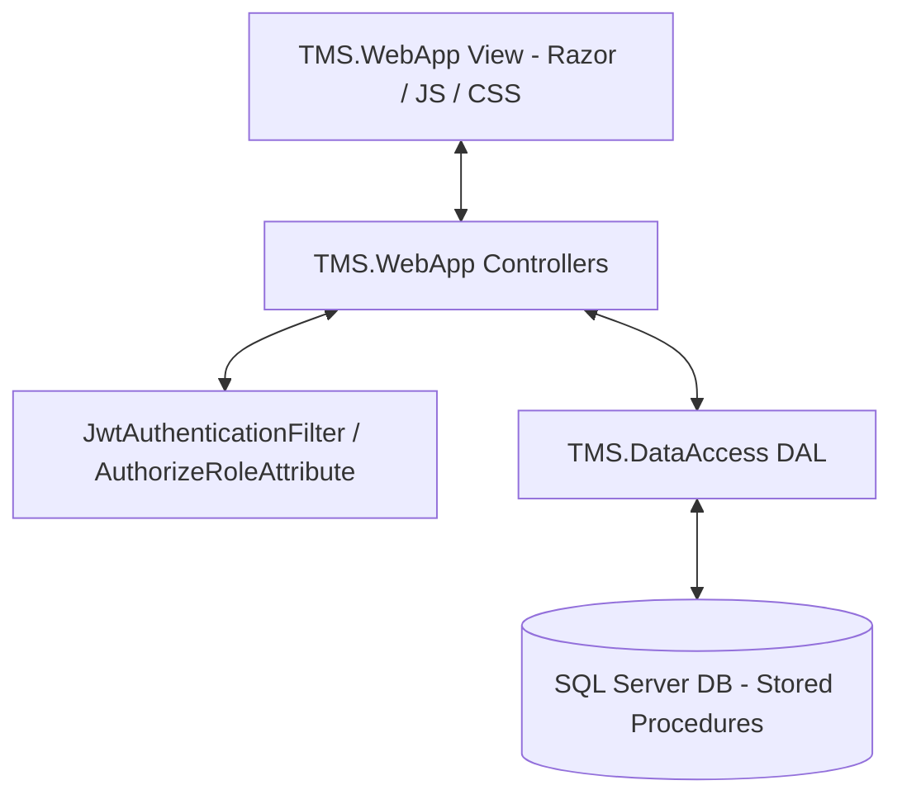
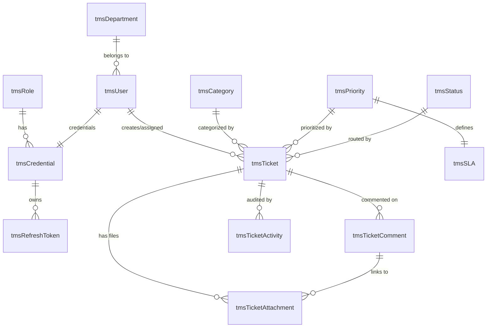
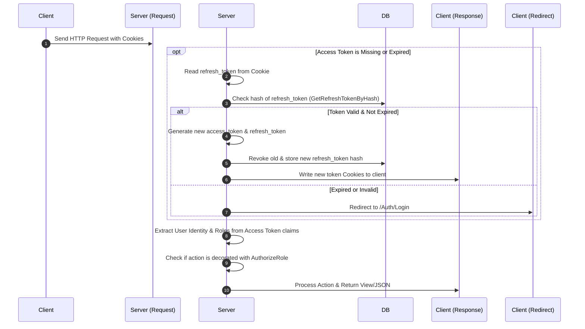
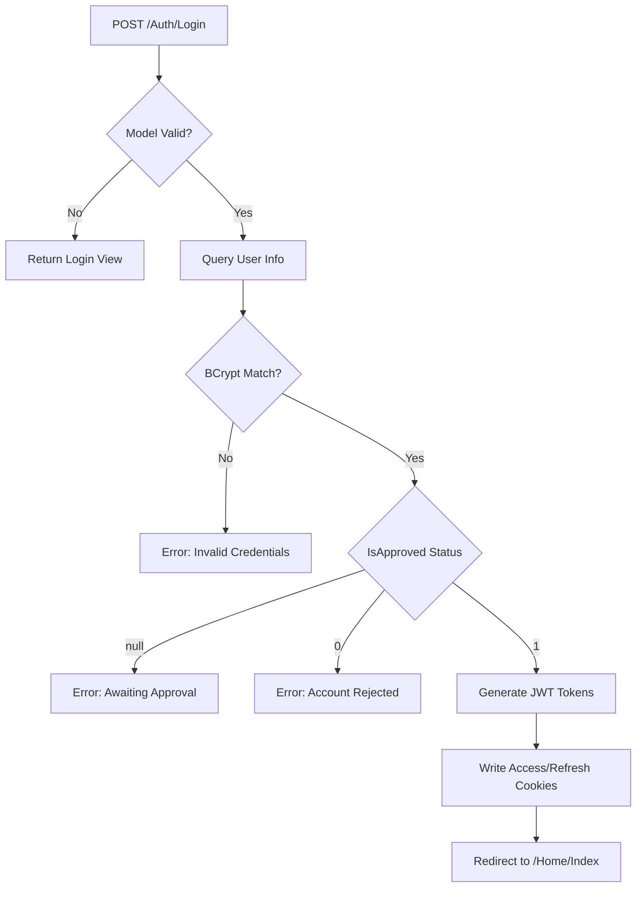
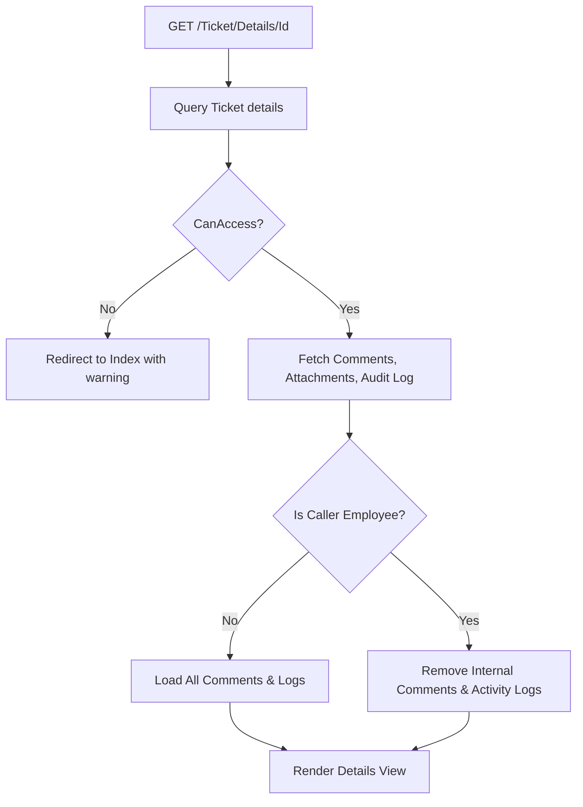

# Ticket Management System (TMS) - Documentation & Technical Reference

Welcome to the **Ticket Management System (TMS)** technical documentation. This project is a robust, N-tier web application designed to streamline internal support ticketing, role-based workflow routing, and audit trail tracking.

---

## 📖 Table of Contents
1. [System Overview & Architecture](#-system-overview--architecture)
2. [Technology Stack](#-technology-stack)
3. [Database Schema & Data Model](#-database-schema--data-model)
4. [Authentication & Authorization Pipeline](#-authentication--authorization-pipeline)
5. [End-to-End Data Flow](#-end-to-end-data-flow)
6. [Detailed Layer Explanation & Key Code Snippets](#-detailed-layer-explanation--key-code-snippets)
    - [Presentation Layer (TMS.WebApp)](#1-presentation-layer-tmswebapp)
    - [Data Access Layer (TMS.DataAccess)](#2-data-access-layer-tmsdataaccess)
7. [Endpoint Workflows & Role Checks](#-endpoint-workflows--role-checks)
    - [Auth Controller](#auth-controller)
    - [Ticket Controller](#ticket-controller)
    - [User Controller](#user-controller)
    - [Profile Controller](#profile-controller)
    - [Dashboard Controller](#dashboard-controller)

---

## 🏗 System Overview & Architecture

The application is structured using a traditional **N-Tier Architecture**, separating concerns across three distinct layers to ensure maintainability, scalability, and security:



1. **Presentation / Web Layer (`TMS.WebApp`)**:
   - Built on **ASP.NET MVC (non-Core / .NET Framework)**.
   - Handles HTTP routing, request parsing, session management, view rendering (Razor Engine `.cshtml`), and client-side interactions (custom Vanilla JS, Ajax, custom CSS).
   - Manages security token validation (JWT verification) via global filters.

2. **Data Access Layer (`TMS.DataAccess`)**:
   - Contains database clients, business models, and data transfer view models.
   - Implemented using **Microsoft Enterprise Library Data Block** for clean connection management and high-performance ADO.NET operations.
   - Decoupled from direct SQL statements; all interactions run through secure **SQL Server Stored Procedures** to prevent SQL injection and encapsulate data access rules.

3. **Database Layer (SQL Server Database)**:
   - Houses the relational tables, foreign key constraints, default rules, and sequence generators.
   - Exposes business logic through stored procedures (e.g., ticket number generation, search filters, state modification, and notifications).

---

## 🛠 Technology Stack

* **Web Framework**: ASP.NET MVC 5
* **Security & Token Management**: 
  - JWT (JSON Web Tokens) using `System.IdentityModel.Tokens.Jwt`
  - Password hashing using `BCrypt.Net`
* **Data Access**: Microsoft Enterprise Library 6.0 Data Access Block (ADO.NET Wrapper)
* **Database Engine**: Microsoft SQL Server
* **Logging Engine**: Serilog (configured for MSSqlServer sink and rolling file logs)
* **Front-End Styling & Logic**: Vanilla CSS (modern dark themes, gradients, and layouts), Vanilla JavaScript (AJAX requests, validation, custom Lightbox, and Select2 integrations), HTML5.

---

## 🗄 Database Schema & Data Model

The relational database consists of 18 tables configured to manage users, security, SLA timelines, routing states, comments, attachments, notifications, and audit logging.



### Core Entity Definitions:
* **`tmsRole`**: Registers user permissions. Supported roles are:
  - `Administrator`: Full system access, configures user permissions, assigns tickets.
  - `Support Executive`: Resolves assigned tickets, posts internal notes.
  - `Employee`: Raises support requests, views own ticket progression, updates own tickets.
* **`tmsDepartment`**: Tracks corporate divisions (IT, HR, Finance, Operations, etc.).
* **`tmsUser`**: Stores core profiles (fullName, mobileNumber, departmentId).
* **`tmsCredential`**: Secures access (emailId, BCrypt hash, role association, approval status `isApproved`).
* **`tmsTicket`**: Holds support details. Automatically generates formatted ticket numbers (e.g., `T-YYYYMM-XXXX`) using `tmsSequence` sequences.
* **`tmsSLA`**: Controls resolution timing targets:
  - `Critical`: 2 hours
  - `High`: 4 hours
  - `Medium`: 8 hours
  - `Low`: 24 hours
* **`tmsTicketComment`**: Manages communication threads, featuring an `isInternal` flag to conceal system diagnostics and agent notes from Employee views.
* **`tmsTicketAttachment`**: Keeps track of file metadata (physical files are cryptographically named with GUIDs and saved under `~/Content/Uploads/Tickets`).
* **`tmsTicketActivity`**: Acts as a strict audit table logging changes in status, assignees, priorities, categories, comments, and attachments.
* **`tmsOtp`**: Facilitates email-verified registration flow (6-digit expiring verification codes).

---

## 🔒 Authentication & Authorization Pipeline

Rather than relying on legacy Session states, the application implements a modern **JWT Cookie-Based Authentication Flow** with automatic refresh token rotation.



---

## 🔄 End-to-End Data Flow

To illustrate how data travels through the tiers, here is the lifecycle of a **Ticket Creation Request**:

1. **Presentation Layer (Client-Side HTML/JS)**:
   - The user fills out the Ticket form in the UI. 
   - A Vanilla JavaScript validation function verifies the inputs, checks file attachment extensions (`.jpg`, `.jpeg`, `.png`, `.gif`, `.webp`, `.pdf`, `.doc`, `.docx`) and file size limit ($5$ MB).
   - Form fields and files are bundled into a `MultipartFormData` payload and POSTed to `/Ticket/Create`.

2. **Web Server Controller Handling (Model Binding & Anti-Forgery)**:
   - The `[ValidateAntiForgeryToken]` attribute verifies token authenticity.
   - The framework binds form parameters directly into a `TicketAddViewModel` instance.
   - If binding validation fails (`ModelState.IsValid == false`), it re-populates selection dropdowns (`Categories`, `Priorities`) and returns the View.

3. **Claims Context Extraction**:
   - `TicketController` inherits from `BaseController`.
   - The base class parses the JWT-authenticated `ClaimsPrincipal` to instantly retrieve the `CurrentUserId` and verify the caller is not a `Support Executive` (who cannot create tickets).

4. **Data Access Block Execution (DAL)**:
   - The controller calls `TicketDAL.CreateTicket(CurrentUserId, Title, Description, CategoryId, PriorityId)`.
   - `TicketDAL` requests a `DbCommand` object calling stored procedure `tmsTicketCreate`.
   - Enterprise Library's database block sets the parameters and executes a reader:
     ```csharp
     DbCommand cmd = db.GetStoredProcCommand("tmsTicketCreate");
     db.AddInParameter(cmd, "@CreatedBy", DbType.Int32, createdBy);
     db.AddInParameter(cmd, "@Title", DbType.String, title);
     // ... Executes and returns generated TicketId
     ```

5. **Stored Procedure Database Execution**:
   - Stored procedure `tmsTicketCreate` runs a transaction:
     - Fetches resolution SLA limits from `tmsSLA` to calculate the `dueDate`.
     - Pulls and increments the monthly ticketing sequence (`tmsSequence`) to format a unique `ticketNumber` (e.g. `T-202608-0001`).
     - Inserts a row into `tmsTicket`.
     - Logs the event in `tmsTicketActivity` as `'Ticket Created'`.
     - Registers a new record in `tmsNotification` for administrators.

6. **File Attachment Storage**:
   - If the request includes a file, the controller creates a new unique name: `Guid.NewGuid().ToString("N") + FileExtension`.
   - Saves it physically on the server web disk inside `~/Content/Uploads/Tickets`.
   - Invokes `TicketDAL.AddAttachment` to bind the new file record to the SQL database.

7. **Redirect / Response**:
   - The controller populates `TempData["info"]` with a confirmation message.
   - Issues an HTTP 302 redirect returning `/Ticket/Details/{TicketId}` back to the client.

---

## 💻 Detailed Layer Explanation & Key Code Snippets

### 1. Presentation Layer (`TMS.WebApp`)

#### Global Filter Setup (`FilterConfig.cs`)
This class forces every request to process through the JWT verification filter and checks authorization headers globally.
```csharp
public class FilterConfig
{
    public static void RegisterGlobalFilters(GlobalFilterCollection filters)
    {
        filters.Add(new HandleErrorAttribute());
        filters.Add(new JwtAuthenticationFilter()); // Intercepts access cookies
        filters.Add(new AuthorizeAttribute());      // Rejects non-authenticated users
    }
}
```

#### JWT Utility Class (`JwtHelper.cs`)
Generates access and refresh tokens, checks JWT signature validity, and executes token rotation:
```csharp
public static class JwtHelper
{
    private static readonly string Secret = ConfigurationManager.AppSettings["JwtSecret"];
    private static readonly string Issuer = ConfigurationManager.AppSettings["JwtIssuer"] ?? "TMS.WebApp";
    private static readonly string Audience = ConfigurationManager.AppSettings["JwtAudience"] ?? "TMS.WebApp.Client";

    public static string GenerateAccessToken(int userId, string fullName, string email, string roleName, string mobile, string department)
    {
        var tokenHandler = new JwtSecurityTokenHandler();
        var key = new SymmetricSecurityKey(Encoding.UTF8.GetBytes(Secret));
        var claims = new[]
        {
            new Claim(ClaimTypes.NameIdentifier, userId.ToString()),
            new Claim(ClaimTypes.Name, fullName ?? ""),
            new Claim(ClaimTypes.Email, email ?? ""),
            new Claim(ClaimTypes.Role, roleName ?? "Employee"),
            new Claim("Mobile", mobile ?? ""),
            new Claim("Department", department ?? "")
        };

        var tokenDescriptor = new SecurityTokenDescriptor
        {
            Subject = new ClaimsIdentity(claims),
            Issuer = Issuer,
            Audience = Audience,
            Expires = DateTime.UtcNow.AddMinutes(15),
            SigningCredentials = new SigningCredentials(key, SecurityAlgorithms.HmacSha256)
        };

        var token = tokenHandler.CreateToken(tokenDescriptor);
        return tokenHandler.WriteToken(token);
    }

    public static ClaimsPrincipal ValidateAccessToken(string token)
    {
        var tokenHandler = new JwtSecurityTokenHandler();
        var key = new SymmetricSecurityKey(Encoding.UTF8.GetBytes(Secret));

        try
        {
            return tokenHandler.ValidateToken(token, new TokenValidationParameters
            {
                ValidateIssuerSigningKey = true,
                IssuerSigningKey = key,
                ValidateIssuer = true,
                ValidIssuer = Issuer,
                ValidateAudience = true,
                ValidAudience = Audience,
                ValidateLifetime = true,
                ClockSkew = TimeSpan.Zero
            }, out _);
        }
        catch
        {
            return null; // Token is expired or tampered with
        }
    }
}
```

#### Custom Security Filter (`JwtAuthenticationFilter.cs`)
Hooks into the ASP.NET pipeline, automatically executing silently behind the scenes for every incoming request:
```csharp
public class JwtAuthenticationFilter : IAuthenticationFilter
{
    public void OnAuthentication(AuthenticationContext filterContext)
    {
        var request = filterContext.HttpContext.Request;
        var response = filterContext.HttpContext.Response;

        string accessToken = request.Cookies["access_token"]?.Value;
        if (!string.IsNullOrEmpty(accessToken))
        {
            var principal = JwtHelper.ValidateAccessToken(accessToken);
            if (principal != null)
            {
                filterContext.HttpContext.User = principal; // Inject claims into context
                return;
            }
        }

        // Access token expired/missing, check refresh token
        string refreshToken = request.Cookies["refresh_token"]?.Value;
        if (!string.IsNullOrEmpty(refreshToken))
        {
            try
            {
                var dal = new AuthDAL();
                var result = JwtHelper.RefreshAccessToken(refreshToken, dal);
                if (result?.Principal != null)
                {
                    filterContext.HttpContext.User = result.Principal;

                    // Append updated security cookies to the client response headers
                    response.Cookies.Add(new HttpCookie("access_token", result.AccessToken) { HttpOnly = true, Path = "/" });
                    response.Cookies.Add(new HttpCookie("refresh_token", result.RefreshToken) { HttpOnly = true, Path = "/" });
                    return;
                }
            }
            catch { /* Ignore and redirect */ }
        }
    }

    public void OnAuthenticationChallenge(AuthenticationChallengeContext filterContext)
    {
        if (filterContext.Result is HttpUnauthorizedResult)
        {
            if (filterContext.HttpContext.Request.IsAjaxRequest())
            {
                filterContext.Result = new JsonResult
                {
                    Data = new { success = false, message = "Session expired. Please login again." },
                    JsonRequestBehavior = JsonRequestBehavior.AllowGet
                };
            }
            else
            {
                filterContext.Result = new RedirectResult("~/Auth/Login");
            }
        }
    }
}
```

#### Claims Extraction Base (`BaseController.cs`)
Encapsulates extraction of token payload variables so that they are easily accessible in any child controller actions:
```csharp
public class BaseController : Controller
{
    protected int CurrentUserId => int.Parse(((ClaimsPrincipal)User).FindFirst(ClaimTypes.NameIdentifier)?.Value ?? "0");
    protected string CurrentRoleName => ((ClaimsPrincipal)User).FindFirst(ClaimTypes.Role)?.Value;
    protected string CurrentUserEmail => ((ClaimsPrincipal)User).FindFirst(ClaimTypes.Email)?.Value;

    protected bool IsAdmin => User.IsInRole("Administrator");
    protected bool IsSupport => User.IsInRole("Support Executive");
    protected bool IsEmployee => User.IsInRole("Employee");
}
```

#### Custom Role Verification Attribute (`AuthorizeRoleAttribute.cs`)
Enforces endpoint access constraints using mapped string checks:
```csharp
public class AuthorizeRoleAttribute : AuthorizeAttribute
{
    private readonly Role[] _allowedRoles;

    public AuthorizeRoleAttribute(params Role[] roles)
    {
        _allowedRoles = roles;
    }

    protected override bool AuthorizeCore(HttpContextBase httpContext)
    {
        if (!base.AuthorizeCore(httpContext)) return false;
        foreach (Role role in _allowedRoles)
        {
            if (httpContext.User.IsInRole(GetDbRoleName(role)))
                return true;
        }
        return false;
    }
}
```

---

### 2. Data Access Layer (`TMS.DataAccess`)

The data access tier implements the Gateway Pattern using ADO.NET and Enterprise Library. 

#### Stored Procedure Parameter Binding Example (`UserDAL.cs`)
```csharp
public class UserDAL
{
    private Database db;

    public UserDAL()
    {
        this.db = DatabaseFactory.CreateDatabase(); // Resolves default database from Web.config
    }

    public void SetUserApproval(int userId, byte? isApproved, int modifiedBy)
    {
        DbCommand cmd = db.GetStoredProcCommand("tmsUserSetApproval");
        db.AddInParameter(cmd, "@UserId", DbType.Int32, userId);
        db.AddInParameter(cmd, "@IsApproved", DbType.Byte, isApproved ?? (object)DBNull.Value);
        db.AddInParameter(cmd, "@ModifiedBy", DbType.Int32, modifiedBy);

        try
        {
            db.ExecuteNonQuery(cmd); // NonQuery runs operations that do not return tabular datasets
        }
        catch (Exception ex)
        {
            Log.Error(ex, "Error in SetUserApproval database call");
            throw;
        }
    }
}
```

---

## 🚪 Endpoint Workflows & Role Checks

### Auth Controller
Controls security operations and is decorated with `[AllowAnonymous]` to let unauthenticated visitors log in.



* **`Login` [GET]**
  - Workflow: Renders the entry form. If the user is already validated (`IsAuthenticated`), bypasses login and redirects directly to Home.
* **`Login` [POST]**
  - Workflow: Parses email and password. Invokes `AuthDAL.UserLogin`. If email exists, uses `BCrypt.Net.BCrypt.Verify` to compare the candidate password against the encrypted hash. Checks if the administrator has approved the account (`IsApproved` must be $1$). Updates login audit headers and generates access/refresh tokens.
* **`Signup` [GET]**
  - Workflow: Fetches active companies and departments using `MasterDataDAL` and populates the registration form.
* **`Signup` [POST]**
  - Workflow: Implements a 2-step verification mechanism:
    - **Step 1 (Create Account Request)**: Validates input fields, checks if the email already exists in the system. Generates a secure random 6-digit OTP code, sets expiration rules, writes a temporary verification state to `tmsOtp`, emails the code to the user via SMTP, and updates the form view state to `otp`.
    - **Step 2 (OTP Verification)**: Matches the entered OTP. If valid, marks the OTP as used in `tmsOtp` and calls `AuthDAL.UserRegister` to create the user profile with `IsApproved = null` (awaiting manual administrator verification).
* **`ResendOtp` [POST]**
  - Workflow: AJAX POST that fetches the last OTP timestamp. Implements throttling (enforces a minimum $60$-second cooldown limit before generating a new code). Generates and sends a new OTP.
* **`Logout` [GET]**
  - Workflow: Extracts the refresh token from the browser cookie, hashes it, calls `AuthDAL.RevokeRefreshToken` to blacklist it in the database, expires access and refresh cookies, and redirects the user to the login screen.

---

### Ticket Controller
Manages the core workflows of support tickets. Inherits all global security controls.



* **`Index` [GET] / `MyAssigned` [GET]**
  - Workflow: Renders the master shell search grids. Loads categories, priorities, and assigned support lists into viewbags for filter dropdowns.
* **`Index` [POST] / `MyAssigned` [POST]**
  - Workflow: Triggers AJAX table listings. Invokes `TicketDAL.GetTicketList` passing sorting parameters, pagination values, search strings, and filter ids. Evaluates roles so that **Employees** can only view tickets they created, **Support Executives** only view their assigned queue (if MyAssigned), and **Administrators** see everything. Renders `_TicketListPartial`.
* **`Create` [GET]**
  - Workflow: Standard form for creating tickets. Rejects access if the caller is a `Support Executive` (they only resolve tickets, they cannot create them).
* **`Create` [POST]**
  - Workflow: Rejects `Support Executive` requests. Validates attachment properties. Calls `TicketDAL.CreateTicket`. If an attachment is uploaded, cryptographically saves the file to server storage and registers metadata via `TicketDAL.AddAttachment`.
* **`Details` [GET]**
  - Workflow: Calls `TicketDAL.GetTicketById`. If null, redirects to Index. Verifies authorization via `CanAccess(ticket)`:
    - **Admin** or **Support**: Access Granted.
    - **Employee**: Can only access if `ticket.CreatedBy == CurrentUserId`. Rejects others.
  - Collects comment and attachment lists. If caller is an `Employee`, filters out internal system comments (`isInternal == true`) and hides the audit trail activity feed.
* **`Update` [POST]**
  - Workflow: Allows modifying the ticket title, description, category, and priority.
    - Rejects access for `Support Executives`.
    - If the caller is an `Employee`, checks that the ticket has not been assigned yet (`ticket.AssignedToUserId == null`) and that they are the owner.
* **`AssignPartial` [GET] / `Assign` [POST]**
  - Role Check: **`[AuthorizeRole(Role.Administrator)]`** only.
  - Workflow: Associates a ticket with a Support Executive, changing the ticket status to `Assigned` and logging the action.
* **`UpdateStatusPartial` [GET] / `UpdateStatus` [POST]**
  - Role Check: **`[AuthorizeRole(Role.Administrator, Role.SupportExecutive)]`** only.
  - Workflow: Modifies the status or priority of a ticket. A `Support Executive` can only update tickets assigned to them. Logs the status update in the activity history.
* **`AddComment` [POST]**
  - Workflow: Adds a new message thread.
    - If `Employee`, forces `isInternal = false`.
    - If `Support Executive` and not assigned to the ticket, comments are forced to `isInternal = true` (acting as private internal advice/notes).
  - Handles new attachments uploaded directly via comment forms.
* **`Delete` [POST]**
  - Role Check: **`[AuthorizeRole(Role.Administrator, Role.Employee)]`** only.
  - Workflow: Support Executives are rejected. If caller is an `Employee`, verifies the ticket has not been assigned yet. Performs a soft-delete (sets `IsActive = 0` in the database).
* **`DownloadFile` [GET] / `PreviewFile` [GET]**
  - Workflow: Validates the attachment ID and verifies that the user is authorized to access the associated ticket. Returns the physical file stream from the disk with correct MIME headers.

---

### User Controller
Provides administration panels for accounts and settings.
* **`[AuthorizeRole(Role.Administrator)]`** is applied at the class level, restricting all endpoints in this controller to Administrators.

* **`Index` [GET/POST]**
  - Workflow: Lists all user profiles with pagination and search filters (by name, email, or role).
* **`Create` [GET/POST]**
  - Workflow: Renders form and registers a new user, hashes the password via BCrypt, and sets `IsApproved = 1` immediately (bypassing OTP since it is created by an admin).
* **`Edit` [GET/POST]**
  - Workflow: Allows editing name, mobile, department, role, and active status.
  - Self-Protection Guards: Rejects requests to edit the administrator's own role or deactivate their own account.
* **`ChangeRole` [POST]**
  - Workflow: Modifies user role values in `tmsCredential`. Prevents self-modification.
* **`SetApproval` [POST]**
  - Workflow: Updates the registration approval status. Options are `approved` (value 1), `rejected` (value 0), or `awaiting` (value null).
* **`ToggleStatus` [POST]**
  - Workflow: Enforces activation or deactivation states. Prevents self-deactivation.
* **`Delete` [POST]**
  - Workflow: Performs a soft-delete on a user profile. Prevents self-deletion.

---

### Profile Controller
Allows verified users to manage their profiles and passwords.
* **`Index` [GET]**
  - Workflow: Loads database profile fields (fullName, mobile, department, role) and renders the edit layout.
* **`Update` [POST]**
  - Workflow: Updates the user's full name and mobile number in the profile database.
* **`ChangePassword` [POST]**
  - Workflow: Validates current password using BCrypt against the stored credential hash. If correct, hashes the new password and updates the credential record.

---

### Dashboard Controller
Provides visual metrics, telemetry, and analytics.
* **`Index` [GET]**
  - Workflow: Calls `DashboardDAL.GetDashboardData`. Automatically filters data based on the caller's role:
    - **Admin**: Views system-wide statistics (total active tickets, unassigned tickets, SLA breaches) and a list of recent tickets.
    - **Support Executive**: Views statistics for tickets assigned to them.
    - **Employee**: Views statistics for tickets they created.
  - Gathers status and priority data for rendering charts in the dashboard view.

---
*Document generated on: 2026-08-03*
